# Proje Adı: AMKS_AUV_ATILAY

### Özet
Bu projenin odak noktası, sualtı araçlarının güvenli bir şekilde konumlarını tespit etmelerini sağlamak amacıyla ses dalgalarını temel alan bir konumlandırma sisteminin tasarımı ve işleyişi üzerinedir. GPS sinyallerinin su altında etkisiz olması nedeniyle sualtı araçları, yolunu bulmak için alternatif teknolojilere ihtiyaç duymaktadırlar. Ancak, mevcut yöntemlerin çoğu ya ilkel ya da yüksek maliyetlidir ve sıklıkla su yüzeyine çıkarak GPS sinyallerini yakalamak zorunda kalırlar. Bu durum, güvenlik sorunlarına yol açabilmekte ve zaman ile enerji kaybına neden olabilmektedir.

Dünya'nın su üstü bölgeleri genellikle GPS sistemleri tarafından keşfedilirken, su altındaki bölgeler bu sinyallere erişememektedir. Bu nedenle birçok otonom sualtı aracı, konumlarını tespit edemediği için kaybolabilmektedir. Sualtı Araçları için Arttırılabilir Menzilli Konumlandırma Sistemi Tasarımı, bu problemi ortadan kaldırma amacı taşımaktadır. Ses dalgaları, uygun koşullar altında su altında binlerce kilometre yol alabilirler. Su yüzeyindeki konum belirleme başarısı elektromanyetik dalgalara dayalıyken, sualtı konum belirleme başarısı mekanik dalga olan ses dalgalarına dayalıdır. Bu sistem, sualtında iletişimin zayıfladığı alanlarda sinyallerin tekrar güçlendirilebileceği sinyal arttırıcılar kullanma yeteneği sunar. İlk olarak iki noktalı bir sonar verici, herhangi bir konumda kaynaklarını belirler, ardından sinyallerin zayıflamaya başladığı yerlere sinyal arttırıcılar konumlandırılır. LBL (Long Baseline), SBL (Short Baseline) ve USBL (Ultra Short Baseline) gibi mevcut sistemler konum belirlemek için iki yollu ölçüm yaparlar. İki sistem arasındaki mesafe; gidip gelen dalganın harcadığı zamanla bulunur. Bu projede yapılması planlanan tasarım ile tek yollu ölçüm yapılır ve saat bilgisi dalgaların içine ikili değerlerle kodlanır. Böylece sinyal gücünün genliğini arttırma potansiyeli yakalandığı gibi yoldan iki kat kazanılmış olur.

Bu projede aynı zamanda sualtı araçlarının daha güvenli bir şekilde konumlandırılması amaçlanmaktadır. Böylece, bağımsızlık ve taşınabilirlik sağlanarak denizaltı haritalama ve konumlandırma operasyonlarına olanak tanınmaktadır. Temel olarak, 10 kHz ile 15 kHz arasında düşük frekansta kare dalga akustik sinyalleri ile bir tür su altı GPS sistemi geliştirmeyi de hedef almaktadır. Bu tasarım, tek yollu verici modülü ile yayın yapmaktadır. Modül, kare dalga akustik sinyaller üreterek alıcı modül tarafından yakalanmasını sağlamaktadır. İki vericili bir sistem tasarlanarak, vericilerin konumu aracın boyutlarına uygun bir şekilde ölçeklendirilebilmektedir. Alıcı, vericilerden gelen sinyallerin zaman farklarını hesaplayarak sualtı aracının konumunu hesaplamaktadır. Proje, 17 bitlik bir veri paketi kullanmaktadır ve her dalga titreşimi bu veriyi alıcıya ileterek saat bilgisini aktarmaktadır. Bu saat bilgisi, sualtı aracının konumunu hesaplamak için kullanılır. Ayrıca, menzil arttırıcı, sinyalin genliğini artırarak iletim mesafesini uzatmaktadır. Son olarak, yardım modülü, araçtan gelen sinyal ile su yüzeyine bir kapsül ateşleyerek GPS sinyalleri ile aracın küresel konumunun tespit edilmesi planlanmaktadır. Gerektiği durumlarda aracın su altındaki konumu küresel koordinatlara dönüştürülebilmektedir.

### Proje Önemi ve Teknolojilerle Karşılaştırma
Sualtı konumlandırma sistemleri, günümüzde hala yeterli bir seviyeye ulaşamamıştır. Sualtı keşifleri ve güvenli seyahat için, konum belirleme hassasiyetinin Küresel Navigasyon Uydu Sistemi (GNSS) ile karşılaştırılabilir düzeyde olması gerekmektedir. Sualtı araçlarının konumunu tespit etme sorunu, can ve araç kayıplarına neden olmaktadır. Örneğin, 18 Haziran Pazar günü Titan adlı denizaltı aracının kaybolup patlaması bu sorunun acı bir örneğidir.

#### Mevcut Teknolojiler
Derin su altında kullanılan üç temel teknoloji vardır: LBL (Long Baseline), SBL (Short Baseline), USBL (Ultra Short Baseline) ve bunların karışımları. Bu sistemler, su altındaki araçların konumlarını belirlemek için çeşitli yöntemler kullanır. LBL sistemler, en hassas ve güvenilir konum bilgisi sağlarken maliyet açısından en yüksek olanıdır. SBL sistemler, daha az maliyetli ve orta hassasiyette konum bilgisi sağlar. USBL sistemler ise maliyet açısından uygun olup, en büyük hataya sahip olan sistemlerdir.

#### AMKS'nin Avantajları
AMKS, bu mevcut sistemlere kıyasla daha geniş bir menzil sunar ve maliyet etkin bir seçenektir. Sualtında referans verici noktalarına gerek duymadan istenilen yere konumlanabilen sualtı araçlarına olanak tanır. Yüksek hassasiyette zaman bilgisi içerir ve aynı anda birden fazla araca konum bilgisi sağlar. Ek maliyet gerektirmez ve sonar alıcıya sahip olan bütün araçlar bu teknolojiyi kullanabilir.

#### Projenin Yöntemi
Projede yapılması planlanan ses dalgalarıyla konumlandırma sistemi, deniz tabanına yerleştirilen istasyonlara kıyasla taşınabilir ve araca bağlı istenilen noktada haritalama ve konumlama operasyonu için bırakılabilir olacaktır. Bu yaklaşım su içinde basit haritalama imkânı sunduğu gibi sualtı araçları için herhangi bir istasyona bağlı kalmaksızın kendi istasyonlarını oluşturabilme imkanını sağlar. Ses dalgasının genliği mesafeye bağlı olarak logaritmik olarak azalır. Bu problemin çözümü için gerekli görüldüğü konumda araç tarafından sualtı tabanına bağımsız güçlendirici konumlandırılarak sinyalin tekrardan anlaşılıp, yakalanılabilmesi sağlanacaktır. Böylece ilk konuma bağlı olarak, sınırları aşan bir konumlandırma sistemi geliştirilecektir. İki vericiden oluşacak olan mini istasyon yapısında pasif sonar sistemi bulundurup, gerekli durumlarda araçtan aldığı bir sinyalle, su yüzeyine aracın bulunduğu koordinatları taşıyan bir kapsül ateşleyebilecektir. Bu kapsül, GPS sinyallerini alıp aracın global olarak en son görüldüğü konumu gerekli yerlere gönderecektir.

### İçindekiler

- [Pictures Klasörü](#pictures-klasörü)
- [Jupyter Notebook Dosyası](#jupyter-notebook-dosyası)
- [Python Dosyaları](#python-dosyaları)

## Pictures Klasörü

Pictures klasöründeki resim dosyalarına buradan ulaşabilirsiniz:

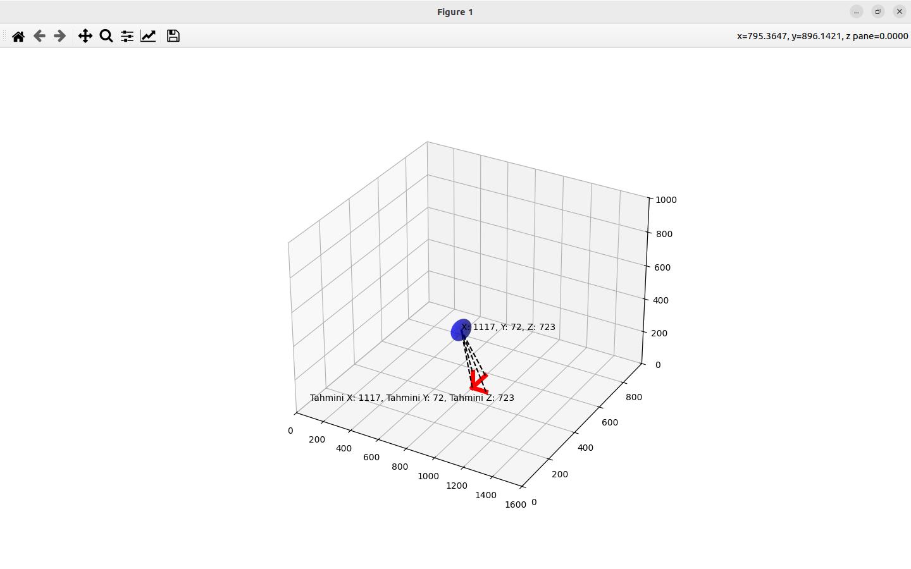
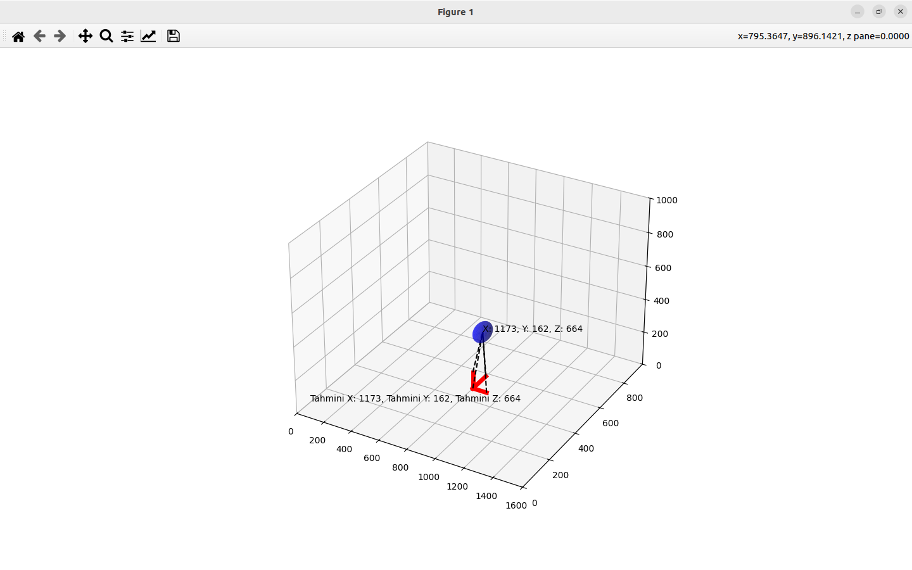
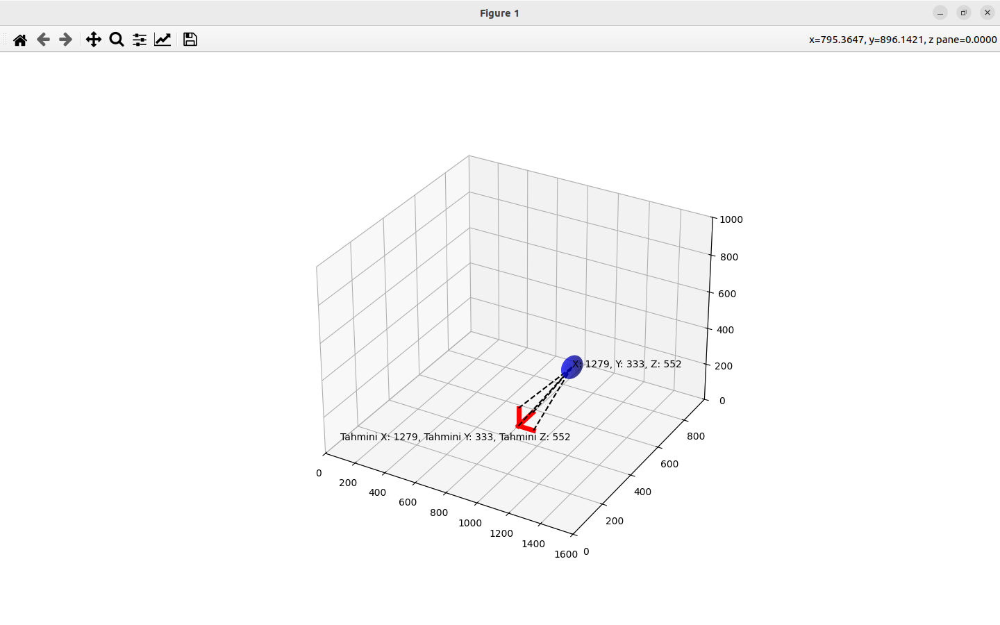
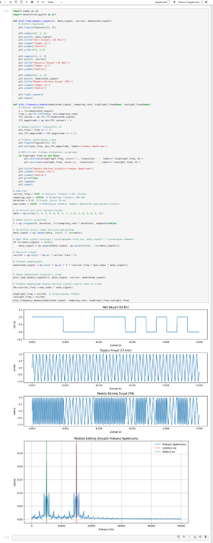
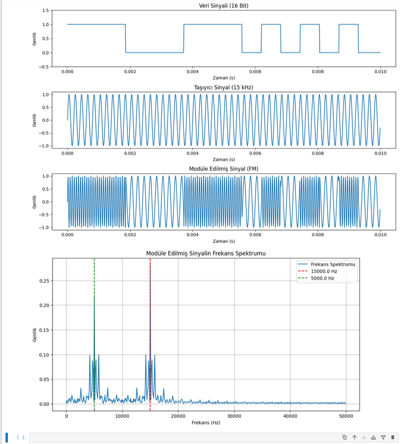
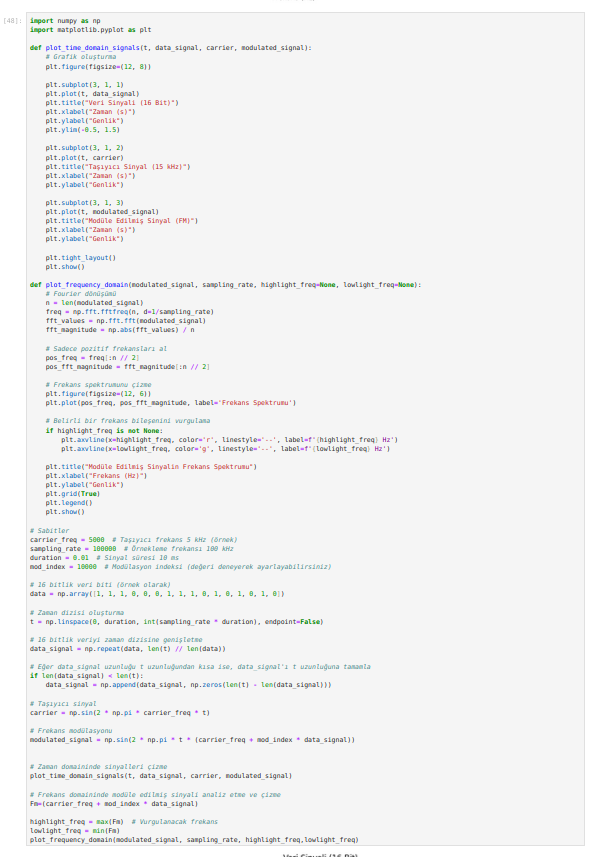
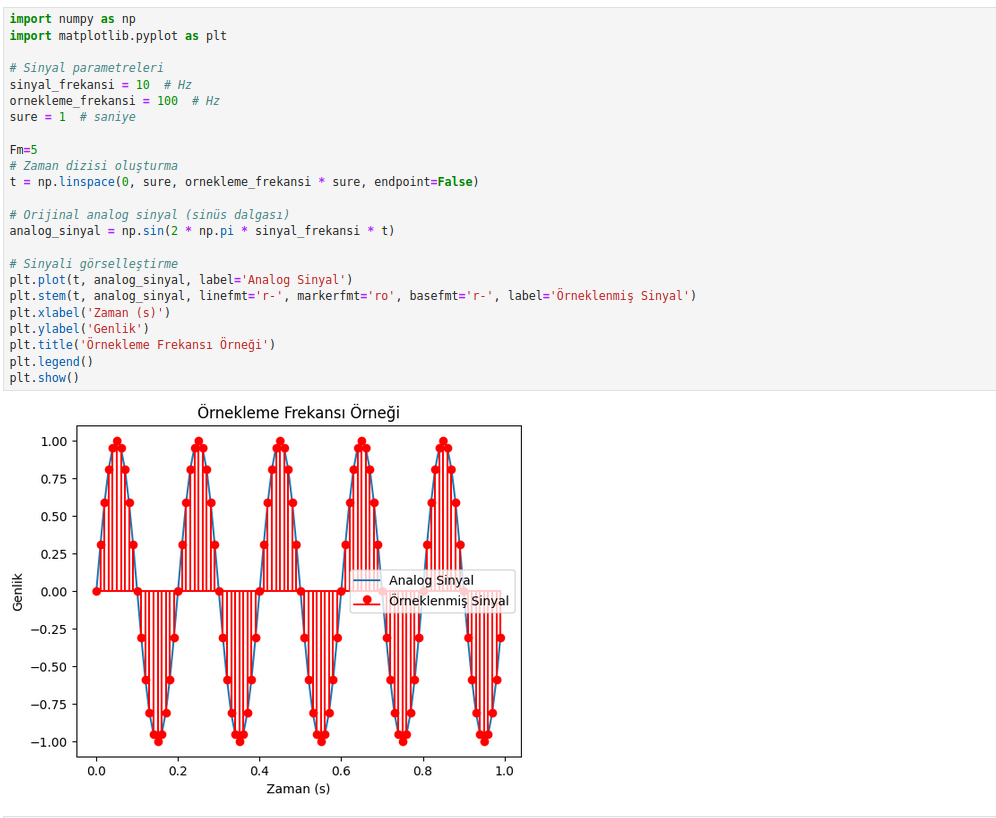
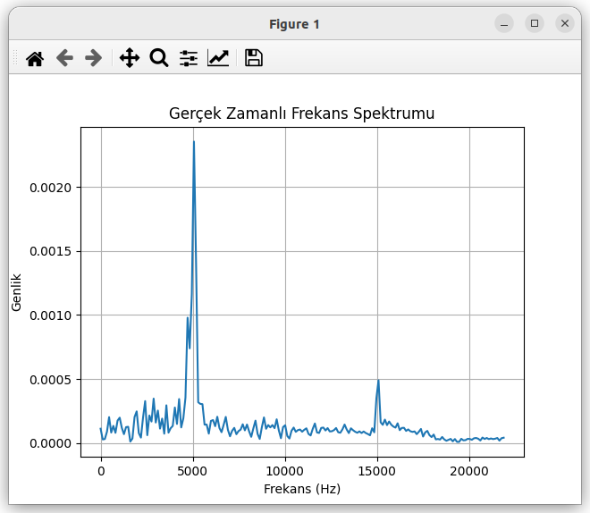
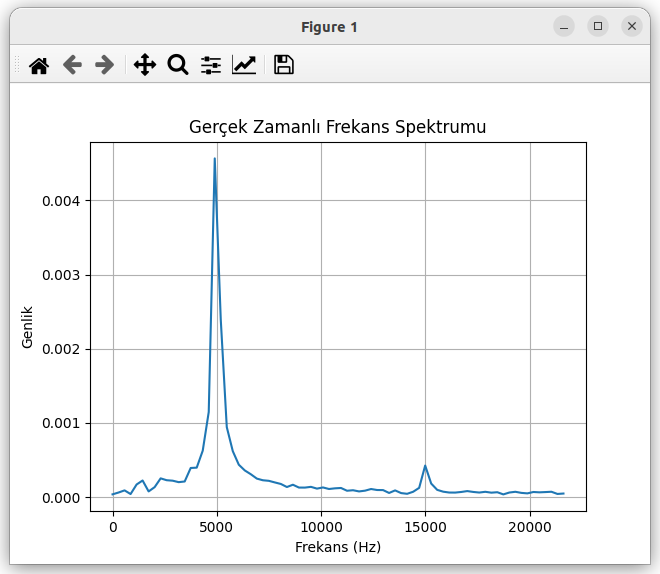
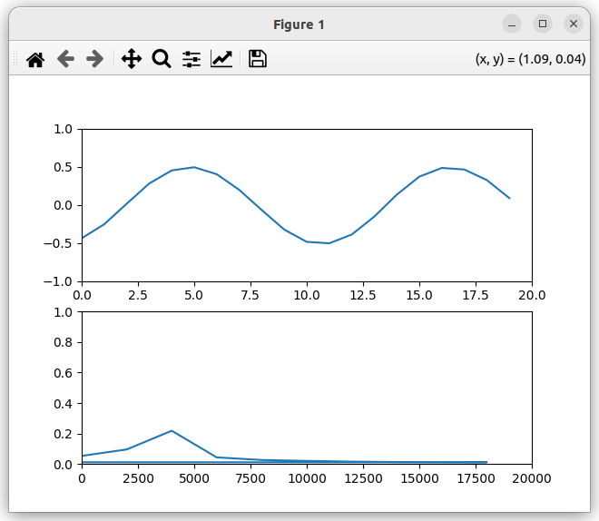
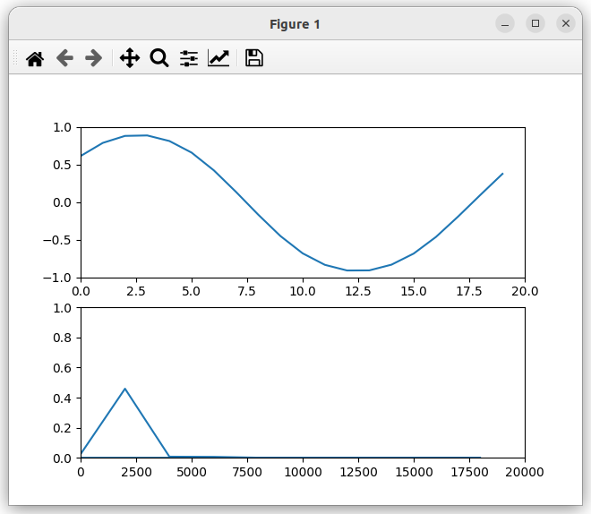

> Not: Resim dosyalarının isimlerini ve uzantılarını dosya adlarıyla eşleştirin.

## Jupyter Notebook Dosyası

Jupyter Notebook dosyasını buradan görüntüleyebilirsiniz:

> Not: Jupyter Notebook dosyasının ismini ve yolunu doğru yazdığınızdan emin olun.

## Python Dosyaları

Aşağıdaki Python dosyalarına buradan ulaşabilirsiniz:

- [sim.py](./sim.py)
- [sim3D2.py](./sim3D2.py)

> Not: Python dosyalarının isimlerini ve yollarını doğru yazdığınızdan emin olun.

### Dosya Açıklamaları

#### Pictures Klasörü
Bu klasör, çeşitli resim dosyalarını içermektedir.

#### .~FM.ipynb
Bu dosya, Jupyter Notebook formatında bir dosyadır.

#### sim.py
Bu Python dosyası, belirli bir simülasyon fonksiyonlarını içerir.

#### sim3D2.py
Bu Python dosyası, 3D simülasyon fonksiyonlarını içerir.
